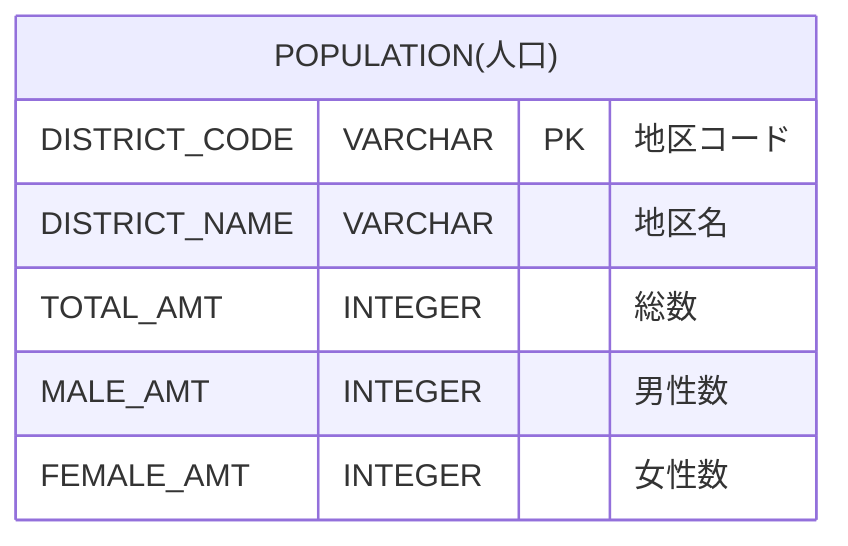

# 問１

- [問１](#問１)
  - [問題](#問題)
    - [表示フォーマット](#表示フォーマット)
    - [テーブル定義](#テーブル定義)
    - [サンプルデータ](#サンプルデータ)
      - [POPULATIONテーブル](#populationテーブル)
  - [回答方法](#回答方法)

## 問題

東京都の人口集中地区の人口を集計した人口テーブルより、東京都の人口一覧を表示しなさい。

表示項目は以下とする。(エイリアスを使用し、"→"を項目名とする)

* DISTRICT_CODE → 地区コード
* DISTRICT_NAME → 地区名
* TOTAL_AMT → 総人口

表示順

1. 総人口の降順
2. 地区コードの降順

### 表示フォーマット

| 地区コード | 地区名   | 総人口 |
|---------|--------|--------|
| 13201   | 八王子市 | 525295 |
| 13104   | 新宿区   | 349385 |
| 13103   | 港区     | 260486 |
：

※あくまでフォーマットを示すもので、正解例ではありません。行数も正解とは異なります。

### テーブル定義

### サンプルデータ

詳細は、同フォルダに配置された`Schema.sql`を参照してください。

#### POPULATIONテーブル

| DISTRICT_CODE | DISTRICT_NAME | TOTAL_AMT | MALE_AMT | FEMALE_AMT |
|---------------|---------------|-----------|----------|------------|
| 13101         | 千代田区          | 66680     | 33637    | 33043      |
| 13102         | 中央区           | 169179    | 80931    | 88248      |
| 13103         | 港区            | 260486    | 123410   | 137076     |
| 13104         | 新宿区           | 349385    | 174822   | 174563     |
| 13105         | 文京区           | 240069    | 115483   | 124586     |
| 13201         | 八王子市          | 525295    | 263997   | 261298     |
| 13202         | 立川市           | 182834    | 90844    | 91990      |
| 13203         | 武蔵野市          | 150149    | 71868    | 78281      |
| 13204         | 三鷹市           | 195391    | 94489    | 100902     |
| 13205         | 青梅市           | 105591    | 53042    | 52549      |

## 回答方法

同フォルダに配置された`Anser.sql`に答えとなるSQL文を記述して、コミット・プッシュしてください。

以上
