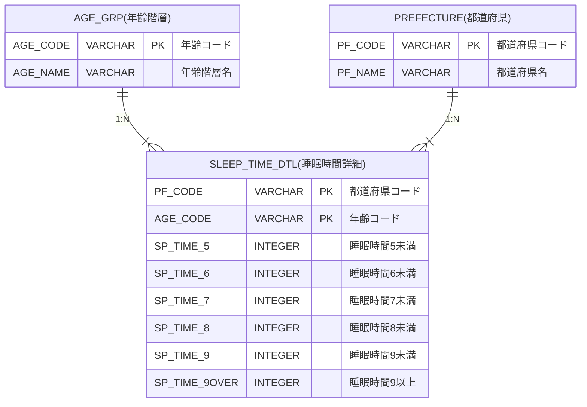

# 問2

- [問2](#問2)
  - [問題](#問題)
    - [表示フォーマット](#表示フォーマット)
    - [テーブル定義](#テーブル定義)
    - [サンプルデータ](#サンプルデータ)
      - [AGE\_GRPテーブル](#age_grpテーブル)
      - [PREFECTUREテーブル](#prefectureテーブル)
      - [SLEEP\_TIME\_DTLテーブル](#sleep_time_dtlテーブル)
  - [回答方法](#回答方法)
  - [ヒント](#ヒント)

## 問題

都道府県別に平均睡眠時間の人数を集計した睡眠時間詳細データより、年齢コード(AGE_CODE)毎にそれぞれの時間帯の人数を集計して表示しなさい。  
ただし、集計する都道府県は、北海道、青森県、岩手県、宮城県、福島県とする。

表示項目は以下とする。(エイリアスを使用し、"→"を項目名とする)

* AGE_CODE → 年齢コード
* AGE_NAME → 年齢階層名
* SP_TIME_5 → 5時間未満
* SP_TIME_6 → 5時間以上6時間未満
* SP_TIME_7 → 6時間以上7時間未満
* SP_TIME_8 → 7時間以上8時間未満
* SP_TIME_9 → 8時間以上9時間未満
* SP_TIME_9OVER → 9時間以上

表示順

1. 年齢コードの昇順

### 表示フォーマット

| 年齢コード | 年齢階層名  | 5時間未満 | 5時間以上6時間未満 | 6時間以上7時間未満 | 7時間以上8時間未満 | 8時間以上9時間未満 | 9時間以上 |
| ----- | ------ | ----- | ---------- | ---------- | ---------- | ---------- | ----- |
| 200   | 20～24歳 | 19    | 94         | 130        | 97         | 24         | 6     |
| 210   | 25～29歳 | 25    | 111        | 137        | 84         | 24         | 8     |
| 240   | 30～34歳 | 32    | 144        | 189        | 112        | 29         | 7     |
| 250   | 35～39歳 | 40    | 189        | 231        | 134        | 30         | 5     |
| 280   | 40～44歳 | 58    | 234        | 249        | 169        | 27         | 5     |

### テーブル定義

### サンプルデータ

詳細は、同フォルダに配置された`Schema.sql`を参照してください。

#### AGE_GRPテーブル

| AGE_CODE | AGE_NAME |
|----------|----------|
| 200      | 20～24歳   |
| 210      | 25～29歳   |
| 240      | 30～34歳   |
| 250      | 35～39歳   |
| 280      | 40～44歳   |

#### PREFECTUREテーブル

| PF_CODE | PF_NAME |
|---------|---------|
| 01000   | 北海道     |
| 02000   | 青森県     |
| 03000   | 岩手県     |
| 04000   | 宮城県     |
| 05000   | 秋田県     |
| 06000   | 山形県     |
| 07000   | 福島県     |
| 08000   | 茨城県     |
| 09000   | 栃木県     |
| 10000   | 群馬県     |
| 11000   | 埼玉県     |
| 12000   | 千葉県     |
| 13000   | 東京都     |
| 14000   | 神奈川県    |
| 15000   | 新潟県     |
| 16000   | 富山県     |
| 17000   | 石川県     |
| 18000   | 福井県     |
| 19000   | 山梨県     |
| 20000   | 長野県     |
| 21000   | 岐阜県     |
| 22000   | 静岡県     |
| 23000   | 愛知県     |
| 24000   | 三重県     |
| 25000   | 滋賀県     |
| 26000   | 京都府     |
| 27000   | 大阪府     |
| 28000   | 兵庫県     |
| 29000   | 奈良県     |
| 30000   | 和歌山県    |
| 31000   | 鳥取県     |
| 32000   | 島根県     |
| 33000   | 岡山県     |
| 34000   | 広島県     |
| 35000   | 山口県     |
| 36000   | 徳島県     |
| 37000   | 香川県     |
| 38000   | 愛媛県     |
| 39000   | 高知県     |
| 40000   | 福岡県     |
| 41000   | 佐賀県     |
| 42000   | 長崎県     |
| 43000   | 熊本県     |
| 44000   | 大分県     |
| 45000   | 宮崎県     |
| 46000   | 鹿児島県    |
| 47000   | 沖縄県     |

#### SLEEP_TIME_DTLテーブル

| PF_CODE | AGE_CODE | SP_TIME_5 | SP_TIME_6 | SP_TIME_7 | SP_TIME_8 | SP_TIME_9 | SP_TIME_9OVER |
|---------|----------|-----------|-----------|-----------|-----------|-----------|---------------|
| 01000   | 160      | 1         | 11        | 25        | 40        | 21        | 3             |
| 01000   | 170      | 9         | 45        | 70        | 51        | 14        | 2             |
| 01000   | 200      | 7         | 37        | 52        | 44        | 10        | 4             |
| 01000   | 210      | 12        | 46        | 52        | 30        | 10        | 5             |
| 01000   | 240      | 13        | 63        | 86        | 43        | 13        | 2             |
| 01000   | 250      | 15        | 77        | 99        | 55        | 11        | 2             |
| 01000   | 280      | 25        | 94        | 104       | 80        | 11        | 1             |
| 01000   | 290      | 37        | 121       | 118       | 66        | 15        | 3             |
| 02000   | 200      | 3         | 10        | 15        | 8         | 3         | 0             |
| 02000   | 210      | 2         | 11        | 16        | 8         | 3         | 1             |
| 02000   | 240      | 3         | 13        | 18        | 11        | 3         | 1             |
| 02000   | 250      | 5         | 19        | 23        | 13        | 4         | 1             |
| 02000   | 280      | 5         | 25        | 26        | 16        | 3         | 1             |
| 02000   | 290      | 7         | 26        | 33        | 17        | 4         | 0             |
| 02000   | 320      | 6         | 26        | 29        | 14        | 3         | 1             |
| 03000   | 160      | 0         | 3         | 8         | 14        | 7         | 0             |
| 03000   | 170      | 2         | 12        | 19        | 13        | 2         | 0             |
| 03000   | 200      | 1         | 7         | 13        | 7         | 2         | 0             |
| 03000   | 210      | 1         | 9         | 13        | 8         | 2         | 0             |
| 03000   | 240      | 2         | 10        | 17        | 11        | 2         | 1             |
| 03000   | 250      | 4         | 21        | 24        | 12        | 5         | 1             |
| 03000   | 280      | 5         | 26        | 24        | 15        | 3         | 0             |
| 04000   | 170      | 4         | 29        | 43        | 28        | 5         | 1             |
| 04000   | 200      | 5         | 26        | 31        | 22        | 5         | 2             |
| 04000   | 210      | 6         | 28        | 33        | 21        | 5         | 1             |
| 04000   | 240      | 7         | 32        | 39        | 28        | 6         | 2             |
| 04000   | 250      | 11        | 43        | 49        | 32        | 5         | 1             |
| 04000   | 280      | 13        | 49        | 52        | 30        | 5         | 2             |
| 04000   | 290      | 13        | 61        | 56        | 27        | 5         | 1             |
| 05000   | 160      | 0         | 2         | 4         | 9         | 5         | 0             |
| 05000   | 170      | 1         | 8         | 13        | 11        | 3         | 0             |
| 05000   | 200      | 0         | 6         | 8         | 6         | 2         | 1             |
| 05000   | 210      | 2         | 9         | 11        | 7         | 2         | 0             |
| 05000   | 240      | 2         | 12        | 16        | 10        | 2         | 0             |
| 05000   | 250      | 3         | 13        | 18        | 9         | 2         | 0             |
| 05000   | 280      | 5         | 18        | 23        | 12        | 3         | 0             |
| 05000   | 290      | 5         | 20        | 21        | 14        | 2         | 0             |
| 05000   | 320      | 5         | 18        | 23        | 11        | 2         | 0             |
| 05000   | 330      | 4         | 20        | 21        | 14        | 3         | 0             |
| 05000   | 360      | 5         | 20        | 27        | 19        | 5         | 1             |
| 05000   | 370      | 4         | 21        | 32        | 26        | 8         | 1             |
| 05000   | 400      | 4         | 15        | 22        | 22        | 7         | 2             |
| 05000   | 410      | 1         | 11        | 16        | 19        | 9         | 2             |
| 05000   | 440      | 2         | 8         | 14        | 17        | 11        | 5             |
| 05000   | 450      | 1         | 4         | 8         | 14        | 13        | 10            |
| 07000   | 160      | 1         | 5         | 17        | 21        | 7         | 1             |
| 07000   | 170      | 5         | 26        | 39        | 19        | 5         | 1             |
| 07000   | 200      | 3         | 14        | 19        | 16        | 4         | 0             |
| 07000   | 210      | 4         | 17        | 23        | 17        | 4         | 1             |
| 07000   | 240      | 7         | 26        | 29        | 19        | 5         | 1             |
| 07000   | 250      | 5         | 29        | 36        | 22        | 5         | 0             |
| 07000   | 280      | 10        | 40        | 43        | 28        | 5         | 1             |
| 07000   | 290      | 10        | 41        | 37        | 18        | 5         | 0             |

## 回答方法

同フォルダに配置された`Anser.sql`に答えとなるSQL文を記述して、コミット・プッシュしてください。

## ヒント

* 県を指定するには、名称もしくはコード値を使います。
* 集計には、GROUP BY句を使います。

以上
