# 問3

- [問3](#問3)
  - [問題](#問題)
    - [表示フォーマット](#表示フォーマット)
    - [テーブル定義](#テーブル定義)
    - [サンプルデータ](#サンプルデータ)
      - [PORTテーブル](#portテーブル)
      - [GRPテーブル](#grpテーブル)
      - [IMMIGRATIONテーブル](#immigrationテーブル)
  - [回答方法](#回答方法)
  - [ヒント](#ヒント)

## 問題

港毎に出入国者の人数を集計した出入国集計データより、外国人の入国者が出国者より多い港を抽出しなさい。  
種別コードは、'110'(入国者) 、'120'(出国者)となる。

表示項目は以下とする。(エイリアスを使用し、"→"を項目名とする)

* PORT_CODE → 港コード
* PORT_NAME → 港名
* 外国人入国者のAMT → 入国者数
* 外国人出国者のAMT → 出国者数
* 外国人入国者のAMT - 外国人出国者のAMTの計算結果 → 差分

表示順

1. 差分の降順
2. 港コードの降順

### 表示フォーマット

| 港コード | 港名       | 入国者数 | 出国者数 | 差分  |
|-------|----------|----------|----------|-------|
| 50970 | 中部(空港) | 262182   | 251135   | 11047 |
| 51270 | 大阪       | 4099     | 1156     | 2943  |
| 51140 | 富山(空港) | 6074     | 5524     | 550   |
| 50560 | 茨城(空港) | 8218     | 7948     | 270   |
| 50740 | 横浜       | 320      | 147      | 173   |

### テーブル定義

```mermaid
erDiagram
"PORT(港)" {
    PORT_CODE  VARCHAR PK "港コード"
    PORT_NAME VARCHAR "港名"
}

"PORT(港)" ||--|{ "IMMIGRATION(入出国集計)" : "1:N"

"IMMIGRATION(入出国集計)" {
    PORT_CODE  VARCHAR PK "港コード"
    GROUP_CODE VARCHAR PK "グループコード"
    KIND_CODE VARCHAR PK "種別コード"
    AMT INTEGER "人数"
}

"GRP(グループ)" ||--|{ "IMMIGRATION(入出国集計)" : "1:N"

"GRP(グループ)" {
    GROUP_CODE  VARCHAR PK "グループコード"
    GROUP_NAME VARCHAR "グループ名"
}
```

<!--

-->

### サンプルデータ

詳細は、同フォルダに配置された`Schema.sql`を参照してください。

#### PORTテーブル

| PORT_CODE | PORT_NAME    |
|-----------|--------------|
| 50210     | 新千歳(空港) |
| 50560     | 茨城(空港)   |
| 50720     | 羽田(空港)   |
| 50730     | 成田(空港)   |
| 50740     | 横浜         |
| 50970     | 中部(空港)   |
| 51130     | 小松(空港)   |
| 51140     | 富山(空港)   |
| 51250     | 関西(空港)   |
| 51270     | 大阪         |

#### GRPテーブル

| GROUP_CODE | GROUP_NAME |
|------------|------------|
| 100        | 計         |
| 110        | 日本人     |
| 120        | 外国人     |
| 130        | 協定該当者 |

#### IMMIGRATIONテーブル

| PORT_CODE | GROUP_CODE | KIND_CODE | AMT     |
|-----------|------------|-----------|---------|
| 50210     | 110        | 110       | 1       |
| 50210     | 110        | 120       | 28609   |
| 50560     | 120        | 110       | 8218    |
| 50560     | 120        | 120       | 7948    |
| 50720     | 120        | 110       | 634562  |
| 50720     | 120        | 120       | 687112  |
| 50730     | 120        | 110       | 1460699 |
| 50730     | 120        | 120       | 1632782 |
| 50740     | 120        | 110       | 320     |
| 50740     | 120        | 120       | 147     |
| 50970     | 120        | 110       | 262182  |
| 50970     | 120        | 120       | 251135  |
| 51130     | 120        | 110       | 8287    |
| 51130     | 120        | 120       | 9569    |
| 51140     | 120        | 110       | 6074    |
| 51140     | 120        | 120       | 5524    |
| 51250     | 120        | 110       | 1011186 |
| 51250     | 120        | 120       | 1115472 |
| 51270     | 120        | 110       | 4099    |
| 51270     | 120        | 120       | 1156    |

## 回答方法

同フォルダに配置された`Answer.sql`に答えとなるSQL文を記述して、コミット・プッシュしてください。

## ヒント

* IMMIGRATIONテーブルから、外国人入国者一覧と外国人出国者一覧の集合を抽出します。
* 上記２つの集合を結合します。この時、同一グループコード・同一港コードを条件とします。
* 結果として、外国人の入国者と出国者が１レコードで抽出できます。
* 表示項目に港名が必要なので、IMMIGRATIONテーブルとPORTテーブルを結合します。
* 差分が0より大きいものをフィルタリングするには、上記で抽出した集合を、サブクエリ化する必要があります。

以上
