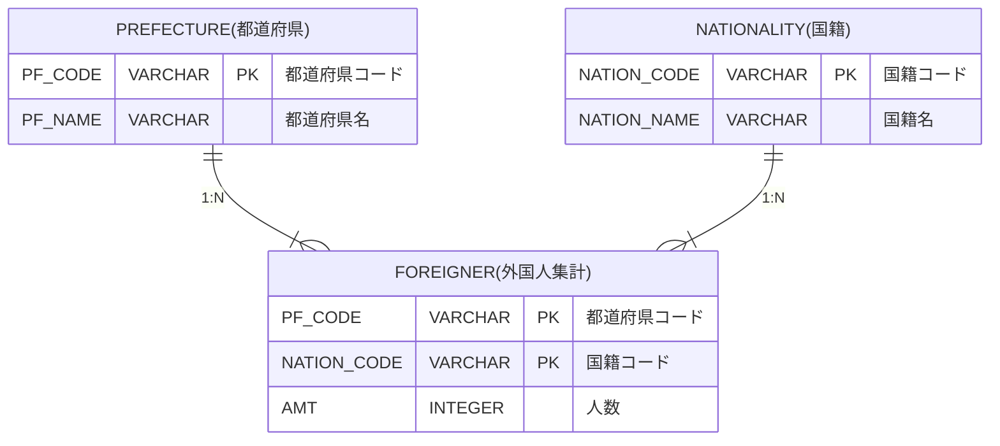
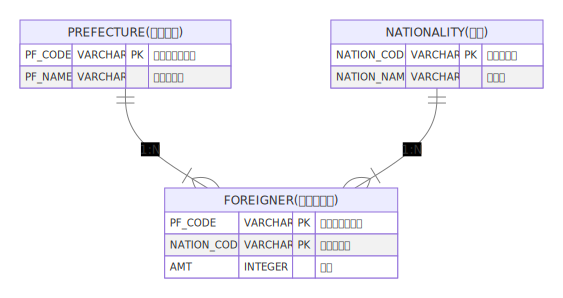

# 問4

- [問4](#問4)
  - [問題](#問題)
    - [表示フォーマット](#表示フォーマット)
    - [テーブル定義](#テーブル定義)
    - [サンプルデータ](#サンプルデータ)
      - [FOREIGNERテーブル](#foreignerテーブル)
      - [NATIONALITYテーブル](#nationalityテーブル)
      - [PREFECTUREテーブル](#prefectureテーブル)
  - [回答方法](#回答方法)

## 問題

都道府県に在住している外国籍の人数を集計した外国人データから、各都道府県で人数が多い国のベスト３を表示しなさい。  
ただし、国籍コード= '113'（その他）のデータは除いて集計すること。  
また、集計した人数が同数の場合は、国籍コードの昇順で順位付けを行うこと。

表示項目は以下とする。(エイリアスを使用し、"→"を項目名とする)

* PF_CODE → 都道府県コード
* PF_NAME → 都道府県名
* 人数が一番多い国のNATION_NAME → 1位 国名
* 人数が一番多い国のAMT → 1位 人数
* 人数が二番目に多い国のNATION_NAME → 2位 国名
* 人数が二番目に多い国のAMT → 2位 人数
* 人数が三番目に多い国のNATION_NAME → 3位 国名
* 人数が三番目に多い国のAMT → 3位 人数
* 各都道府県毎の外国人の合計人数 → 合計人数

表示順

1. 合計人数の降順
2. 都道府県コードの昇順

### 表示フォーマット

| 都道府県コード | 都道府県名 | 1位 国名  | 1位 人数 | 2位 国名  | 2位 人数 | 3位 国名 | 3位 人数 | 合計人数 |
|-------------|---------|-----------|----------|-----------|----------|----------|----------|----------|
| 13000       | 東京都     | 中国      | 195219   | 韓国，朝鮮 | 79079    | フィリピン    | 27156    | 392726   |
| 27000       | 大阪府     | 韓国，朝鮮 | 80548    | 中国      | 59323    | ベトナム     | 25905    | 188375   |
| 23000       | 愛知県     | ブラジル      | 44421    | 中国      | 35989    | フィリピン    | 27706    | 177341   |
| 14000       | 神奈川県   | 中国      | 62932    | 韓国，朝鮮 | 23991    | フィリピン    | 17920    | 157765   |
| 11000       | 埼玉県     | 中国      | 53966    | ベトナム      | 15951    | フィリピン    | 14186    | 114219   |

### テーブル定義

<!--

-->

### サンプルデータ

詳細は、同フォルダに配置された`Schema.sql`を参照してください。

#### FOREIGNERテーブル

| PF_CODE | NATION_CODE | AMT    |
|---------|-------------|--------|
| 11000   | 101         | 12682  |
| 11000   | 102         | 53966  |
| 11000   | 103         | 14186  |
| 11000   | 104         | 2038   |
| 11000   | 105         | 1615   |
| 11000   | 106         | 15951  |
| 11000   | 107         | 927    |
| 11000   | 108         | 3962   |
| 11000   | 109         | 467    |
| 11000   | 110         | 1421   |
| 11000   | 111         | 4727   |
| 11000   | 112         | 2277   |
| 11000   | 113         | 30745  |
| 13000   | 101         | 79079  |
| 13000   | 102         | 195219 |
| 13000   | 103         | 27156  |
| 13000   | 104         | 6416   |
| 13000   | 105         | 3995   |
| 13000   | 106         | 24799  |
| 13000   | 107         | 11636  |
| 13000   | 108         | 17893  |
| 13000   | 109         | 5375   |
| 13000   | 110         | 16376  |
| 13000   | 111         | 3154   |
| 13000   | 112         | 1628   |
| 13000   | 113         | 88334  |
| 14000   | 101         | 23991  |
| 14000   | 102         | 62932  |
| 14000   | 103         | 17920  |
| 14000   | 104         | 3256   |
| 14000   | 105         | 2932   |
| 14000   | 106         | 17409  |
| 14000   | 107         | 4528   |
| 14000   | 108         | 5583   |
| 14000   | 109         | 1276   |
| 14000   | 110         | 5157   |
| 14000   | 111         | 7426   |
| 14000   | 112         | 5355   |
| 14000   | 113         | 31926  |
| 23000   | 101         | 23242  |
| 23000   | 102         | 35989  |
| 23000   | 103         | 27706  |
| 23000   | 104         | 1990   |
| 23000   | 105         | 4148   |
| 23000   | 106         | 25493  |
| 23000   | 107         | 773    |
| 23000   | 108         | 6030   |
| 23000   | 109         | 490    |
| 23000   | 110         | 1684   |
| 23000   | 111         | 44421  |
| 23000   | 112         | 5375   |
| 23000   | 113         | 18125  |
| 27000   | 101         | 80548  |
| 27000   | 102         | 59323  |
| 27000   | 103         | 7232   |
| 27000   | 104         | 2085   |
| 27000   | 105         | 2665   |
| 27000   | 106         | 25905  |
| 27000   | 107         | 983    |
| 27000   | 108         | 3007   |
| 27000   | 109         | 838    |
| 27000   | 110         | 2475   |
| 27000   | 111         | 2294   |
| 27000   | 112         | 1020   |
| 27000   | 113         | 16636  |

#### NATIONALITYテーブル

| NATION_CODE | NATION_NAME |
|-------------|-------------|
| 101         | 韓国，朝鮮   |
| 102         | 中国        |
| 103         | フィリピン       |
| 104         | タイ          |
| 105         | インドネシア      |
| 106         | ベトナム        |
| 107         | インド         |
| 108         | ネパール        |
| 109         | イギリス        |
| 110         | アメリカ        |
| 111         | ブラジル        |
| 112         | ペルー         |
| 113         | その他        |

#### PREFECTUREテーブル

| PF_CODE | PF_NAME  |
|---------|----------|
| 01000   | 北海道   |
| 02000   | 青森県   |
| 03000   | 岩手県   |
| 04000   | 宮城県   |
| 05000   | 秋田県   |
| 06000   | 山形県   |
| 07000   | 福島県   |
| 08000   | 茨城県   |
| 09000   | 栃木県   |
| 10000   | 群馬県   |
| 11000   | 埼玉県   |
| 12000   | 千葉県   |
| 13000   | 東京都   |
| 14000   | 神奈川県 |
| 15000   | 新潟県   |
| 16000   | 富山県   |
| 17000   | 石川県   |
| 18000   | 福井県   |
| 19000   | 山梨県   |
| 20000   | 長野県   |
| 21000   | 岐阜県   |
| 22000   | 静岡県   |
| 23000   | 愛知県   |
| 24000   | 三重県   |
| 25000   | 滋賀県   |
| 26000   | 京都府   |
| 27000   | 大阪府   |
| 28000   | 兵庫県   |
| 29000   | 奈良県   |
| 30000   | 和歌山県 |
| 31000   | 鳥取県   |
| 32000   | 島根県   |
| 33000   | 岡山県   |
| 34000   | 広島県   |
| 35000   | 山口県   |
| 36000   | 徳島県   |
| 37000   | 香川県   |
| 38000   | 愛媛県   |
| 39000   | 高知県   |
| 40000   | 福岡県   |
| 41000   | 佐賀県   |
| 42000   | 長崎県   |
| 43000   | 熊本県   |
| 44000   | 大分県   |
| 45000   | 宮崎県   |
| 46000   | 鹿児島県 |
| 47000   | 沖縄県   |

## 回答方法

同フォルダに配置された`Answer.sql`に答えとなるSQL文を記述して、コミット・プッシュしてください。

以上
